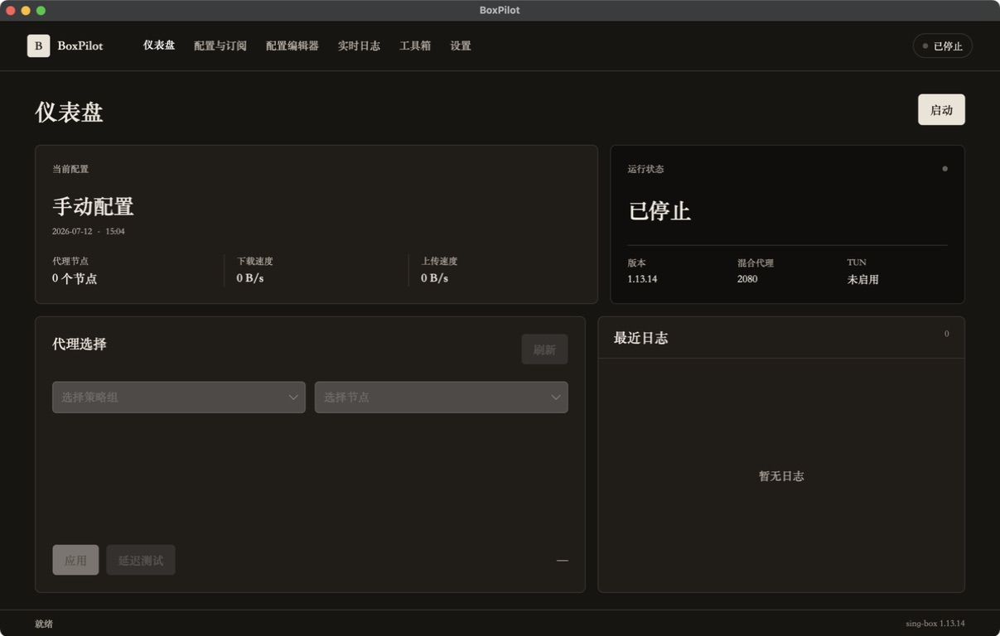

# BoxPilot

BoxPilot 是一个基于 **Avalonia 12** 与 **.NET 10** 的现代化 sing-box 桌面客户端。它使用同一套代码运行于 macOS 和 Windows，并直接管理系统中已安装的 sing-box 内核。



## 功能

- 启动、停止、重启 sing-box；日志采用有界缓冲和批量刷新，以限制内存与 UI 更新频率。
- 导入 Clash YAML、sing-box JSON、Base64 及常见代理 URI 订阅。
- 转换 Clash 节点、策略组和常见路由规则，导入前调用 `sing-box check` 验证。
- 通过 Clash API 切换节点、测试延迟并显示实时上下行流量。
- 提供完整 JSON 配置工作室和 CLI 工具箱，因此不会限制 sing-box 的高级或新增功能。
- 支持系统代理、TUN、订阅更新、配置格式化及原子化存储。
- 内置浅色、深色、跟随系统三种主题，以及简体中文和英文界面。
- 系统托盘、macOS/Windows 原生窗口和四种发布架构。

## 快速开始

要求安装 [.NET 10 SDK](https://dotnet.microsoft.com/download) 和 `sing-box`。BoxPilot 会依次检查应用目录、常见安装路径和 `PATH`。

```bash
make setup      # 还原 NuGet 依赖
make run        # 启动开发版本
make test       # 运行全部 xUnit 测试
make lint       # 验证代码格式
```

启动后打开“配置与订阅”，粘贴订阅地址并导入。订阅转换产生的警告会在界面中列出；原始 sing-box JSON 可在“配置编辑器”中无损编辑。

## 跨平台发布

```bash
./scripts/publish.sh osx-arm64
./scripts/publish.sh osx-x64
./scripts/publish.sh win-x64
./scripts/publish.sh win-arm64
```

自包含产物和 ZIP 包位于 `dist/<RID>/`。macOS 输出标准 `.app`，Windows 输出带嵌入图标的 `.exe`。TUN 在 macOS 上通常需要 root 权限，在 Windows 上可能需要管理员权限；普通系统代理模式不需要提权。

## 数据与安全

配置、订阅地址和 API 密钥只保存在当前用户的本地应用数据目录：

- macOS：`~/Library/Application Support/BoxPilot/`
- Windows：`%LOCALAPPDATA%\BoxPilot\`

Unix 上的敏感文件使用仅当前用户可读写的权限。仓库和日志不会包含订阅内容或凭据。Clash API 默认只监听 `127.0.0.1`，并使用随机生成的密钥。

## 架构

- `src/BoxPilot.App/`：Avalonia UI、主题、本地化、托盘和 MVVM 视图模型。
- `src/BoxPilot.Core/`：内核进程、配置、订阅转换、持久化和 Clash API。
- `tests/BoxPilot.Core.Tests/`：解析、存储、命令行及本机 sing-box 集成测试。

更多设计说明见 [`docs/ARCHITECTURE.md`](docs/ARCHITECTURE.md)。
